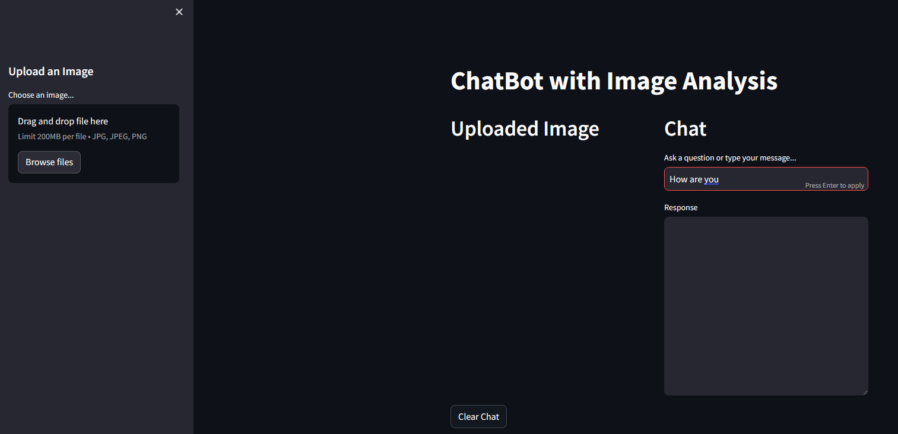
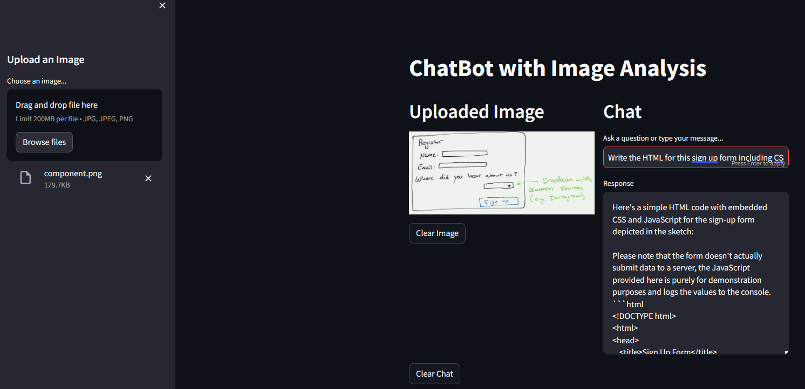
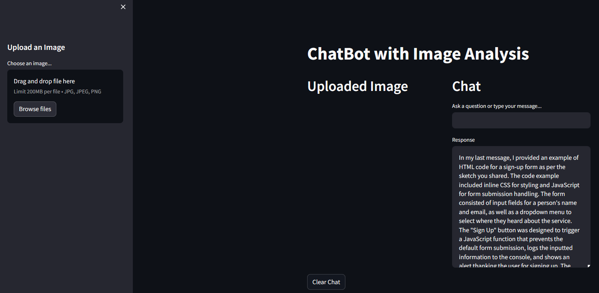

# ChatGPT Image Interface

An interface to analyze photos with ChatGPT since there is currently a waitlist for ChatGPT Plus.

- [First time setup](#first-time-setup)
- [To use the app](#to-use-the-app)
- [How it was made](#how-it-was-made)
- [Files](#files)

## First time setup:

1. Ensure you have python installed
2. `python -m venv venv` to create a virtual environment
3. `. venv/bin/activate` to activate the virtual environment on Mac/Linux and `.\venv\Scripts\activate.bat` on Windows
4. `pip install -r requirements.txt` to install requirements
5. Rename `.env.example` to `.env` and paste your OpenAI API key in place of `your-key-here` in the file
    - IMPORTANT: Make sure to never share this file with anyone or check it in to source control

## To use the App
1. From the project directory, open a terminal and activate the virtual environment
    1. `. venv/bin/activate` to activate the virtual environment on Mac/Linux and `.\venv\Scripts\activate.bat` on Windows
1. Run `streamlit run app.py` in a terminal (with the virtual environment activated) to launch the app
2. You can type a message to get a response

3. Or you can upload an image to ask something about it. Here I uploaded `component.png` and asked ChatGPT to write the code for the interface. Then output can be seen in `component.html`.

4. The chat has memory so you can ask about previous messages

## How it was made

I had a conversation with ChatGPT to write the interface in `chat.ipynb`. First, I wrote some simple code to interact with ChatGPT via the OpenAI API. Then, I asked ChatGPT to write a streamlit app, passing in an image of what I wanted (`ui.png`). I then asked for with follow up changes to iteratively alter the interface. The final application code is in `app.py`. It even made changes to the original code that I used to interact with it. The final code can be seen in `chat_bot.py`. 

## Files

- `images/` - images for this readme
- `app.py` - Streamlit UI that ChatGPT wrote
- `chat_bot.py` - simple class for interacting with ChatGPT via OpenAI API
- `chat.ipynb` - Jupyter notebook showing chat with ChatGPT that lead to the final forms of `app.py` and `chat_bot.py`
- `component.png` - diagram of signup form used to show how Streamlit UI works
- `component.html` - code that ChatGPT wrote when asked to create a working HTML component for `component.png`
- `ui.png` - drawing of desired Streamlit UI interface